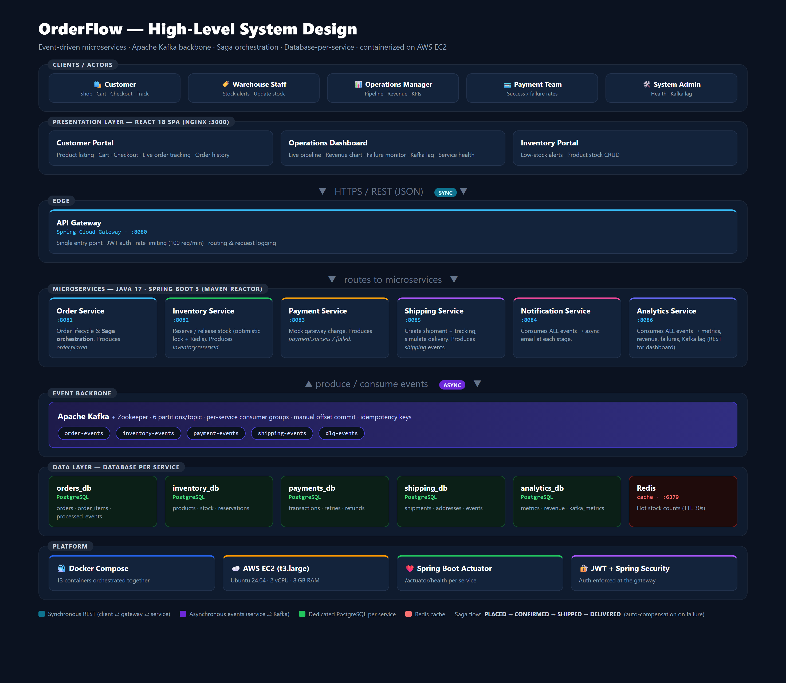
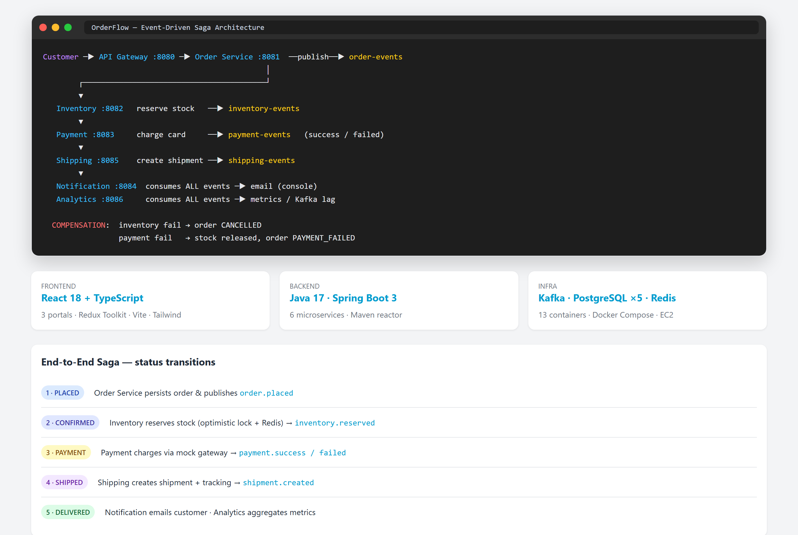
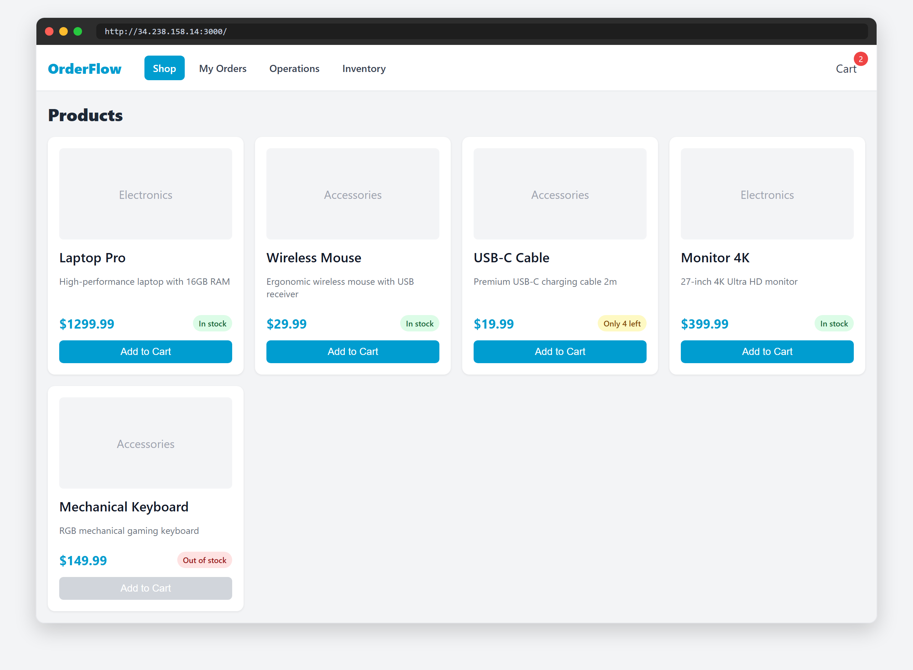
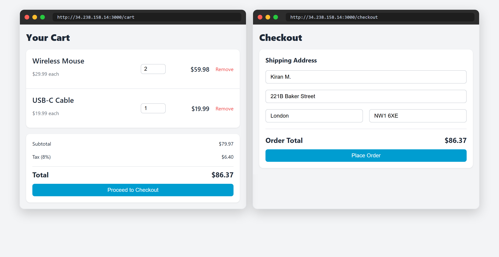
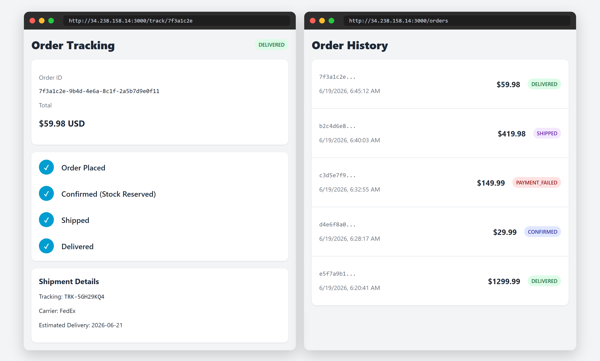
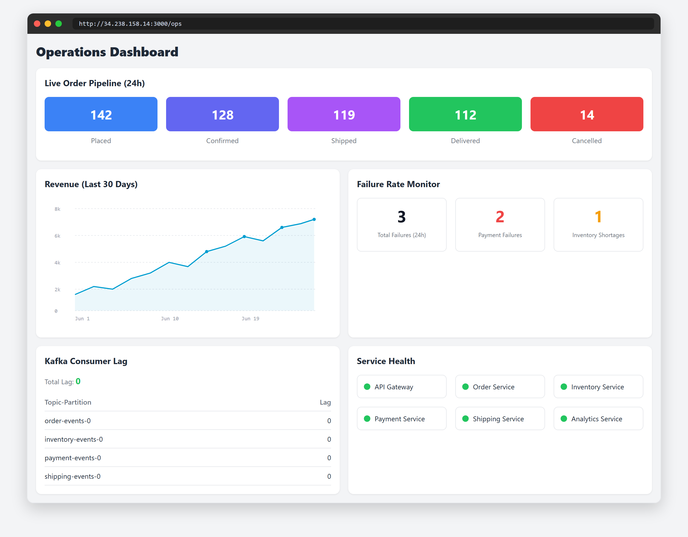
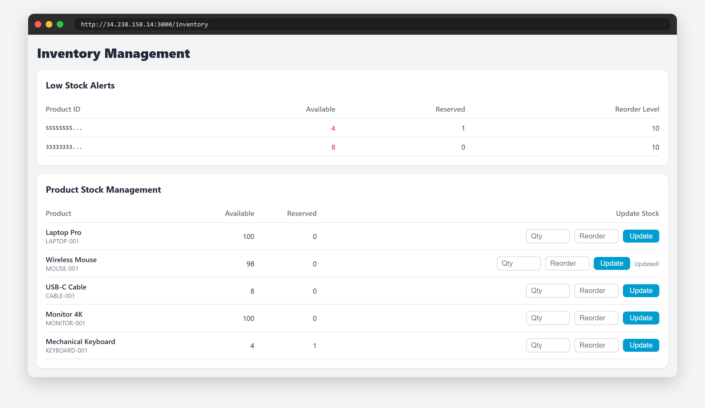
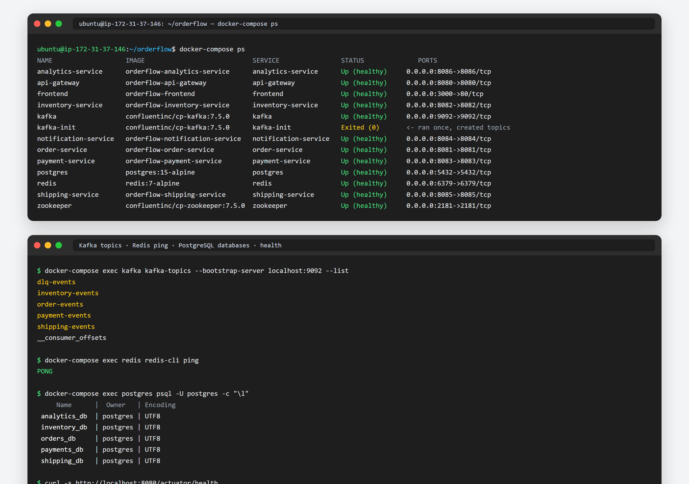
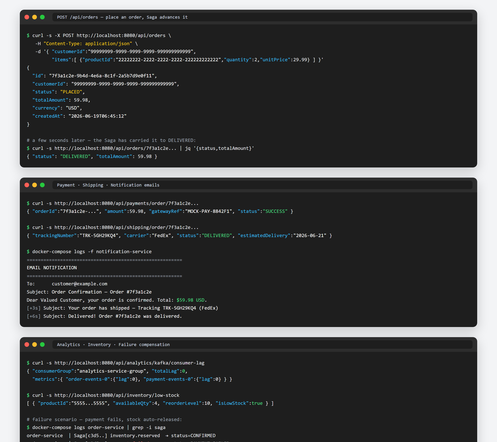

# OrderFlow — Distributed E-Commerce Order Processing Platform

A complete microservices-based e-commerce order processing system demonstrating Kafka event-driven architecture, Saga pattern, and distributed transactions.

## 🏛️ System Design — High-Level Architecture



*Clients → React portals → API Gateway (sync REST) → microservices that communicate **asynchronously via Kafka** → database-per-service. The Saga flow `PLACED → CONFIRMED → SHIPPED → DELIVERED` runs across services with automatic compensation on failure.*

## 📸 Live Demo — Feature Screenshots

> Captured from the live stack on EC2 (`http://34.238.158.14:3000`). Each tab below is collapsible — click a title to expand its screenshot.

<details open>
<summary><b>🏗️ Architecture &amp; Saga Flow</b></summary>



</details>

<details>
<summary><b>🛒 Customer Portal · Shop (Product Listing)</b></summary>



</details>

<details>
<summary><b>🧺 Customer Portal · Cart &amp; Checkout</b></summary>



</details>

<details>
<summary><b>📦 Customer Portal · Order Tracking &amp; History</b></summary>



</details>

<details>
<summary><b>📊 Operations Dashboard</b></summary>



</details>

<details>
<summary><b>🏷️ Inventory Management Portal</b></summary>



</details>

<details>
<summary><b>🖥️ AWS EC2 Terminal · Stack Status &amp; Health</b></summary>



</details>

<details>
<summary><b>⚡ AWS EC2 Terminal · Place Order &amp; Saga (API outputs)</b></summary>



</details>

## 🎯 Problem Statement

Modern e-commerce platforms process **millions of orders per day**. A traditional **monolithic** architecture struggles to handle this because:

- **Peak-load ingestion** — flash sales and Black Friday spikes overwhelm a single application; one slow component (e.g. payment) backs up the entire request thread pool.
- **Coupled scaling** — payment, inventory, and shipping have very different load profiles, but a monolith forces you to scale them together, wasting resources.
- **All-or-nothing failures** — if payment fails *after* stock is taken, naïve systems either cancel the whole order or leave inventory "stuck" reserved. A classic two-phase commit (2PC) across services doesn't scale and creates locks.
- **No real-time visibility** — customers can't see live order progress, and operations teams have no single view of pipeline health, revenue, or where orders are failing.
- **Tight coupling** — synchronous REST calls between services create cascading failures: if shipping is down, orders can't even be placed.

## 💡 How OrderFlow Solves It

OrderFlow decomposes the order lifecycle into **7 independent microservices** that communicate **asynchronously through Apache Kafka**, with each service owning its own database. This directly addresses every problem above:

| Problem | OrderFlow's Solution |
|---|---|
| Peak-load ingestion | Orders are accepted instantly and published to Kafka; downstream work happens asynchronously, so a slow service never blocks order intake. Kafka **buffers** spikes. |
| Coupled scaling | Each service scales independently. Kafka topics use **6 partitions**, so a hot service (e.g. Inventory during a flash sale) can run multiple consumer instances in parallel. |
| All-or-nothing failures | The **Saga pattern** replaces 2PC. Each step emits an event; on failure, a **compensating action** runs — e.g. payment fails → inventory reservation is automatically released, order marked `PAYMENT_FAILED`. No distributed locks. |
| Service crash mid-flow | Kafka **retains** unacknowledged messages. A restarted service reprocesses from its last committed offset; **idempotency keys** (order ID in `processed_events`) prevent duplicate processing. |
| No real-time visibility | The **Analytics Service** consumes every event and powers a live **Operations Dashboard** (pipeline counts, revenue chart, failure rates, Kafka consumer lag, service health). Customers get a **live tracking timeline**. |
| Tight coupling | Services never call each other synchronously. They publish/subscribe to Kafka topics, so shipping being down can't stop an order from being placed — it just processes later. |
| Shared-DB contention | **Database-per-service** (`orders_db`, `inventory_db`, `payments_db`, `shipping_db`, `analytics_db`) enforces loose coupling — one service's schema change never forces another to redeploy. |

**Result:** a resilient, horizontally-scalable order platform where failures are isolated and self-healing, every stage is observable in real time, and each service can be developed, deployed, and scaled on its own. The end-to-end flow (`PLACED → CONFIRMED → SHIPPED → DELIVERED`, with automatic compensation on failure) is shown in the [screenshots above](#-live-demo--feature-screenshots) and detailed in the [Saga section](#order-flow-saga-pattern) below.

## Tech Stack

- **Frontend:** React 18 + TypeScript + Tailwind CSS + Redux
- **Backend:** Java 17 Spring Boot 3
- **Message Broker:** Apache Kafka 3.6
- **Databases:** PostgreSQL 15 (per-service databases)
- **Cache:** Redis 7
- **Containerization:** Docker + Docker Compose
- **Orchestration:** Kubernetes (optional, uses Docker Compose for dev)
- **API Gateway:** Spring Cloud Gateway
- **Auth:** JWT (Spring Security)

## Project Architecture

The backend is a **Maven multi-module (reactor) monorepo**: a single parent POM
(`services/pom.xml`) aggregates all microservices, centralizes dependency
versions, and lets you build everything with one command. Each service is an
independent Spring Boot module following the standard **layered package
architecture** (`controller → service → repository → entity`, plus `kafka`,
`event`, `config`, `dto`).

```
orderflow/
├── services/                         # Maven multi-module reactor (backend)
│   ├── pom.xml                       # ← Parent/reactor POM (versions + modules)
│   ├── .dockerignore                 # Keeps Docker build context lean
│   ├── api-gateway/                  # Spring Cloud Gateway (8080)
│   ├── order-service/                # Order mgmt + Saga orchestration (8081)
│   ├── inventory-service/            # Stock mgmt + Redis caching (8082)
│   ├── payment-service/              # Payment processing (8083)
│   ├── notification-service/         # Async notifications (8084)
│   ├── shipping-service/             # Shipment mgmt + delivery sim (8085)
│   └── analytics-service/            # Metrics & Kafka lag (8086)
│
├── frontend/                         # React 18 + TS (Vite) — 3 portals
│   └── src/
│       ├── components/               # Shared UI (Navbar, StatusBadge)
│       ├── pages/
│       │   ├── CustomerPortal/       # Shop, Cart, Checkout, Tracking, History
│       │   ├── OperationsDashboard/  # Pipeline, Revenue, Failures, Lag, Health
│       │   └── InventoryPortal/      # Stock dashboard + product CRUD
│       ├── services/                 # RTK Query API client
│       ├── store/                    # Redux Toolkit (auth, cart) + hooks
│       └── types/                    # Shared TypeScript types
│
├── infrastructure/
│   ├── postgres/init/                # Per-service DB init SQL (01..05)
│   └── kafka/create-topics.sh        # Kafka topic creation
│
├── docker-compose.yml                # Full stack (13 containers) for EC2
├── ec2-setup.sh                      # EC2 bootstrap (Docker + build + run)
├── Makefile                          # build / up / down / logs helpers
├── README.md                         # This file
├── IMPLEMENTATION_PLAN.md            # Architecture & build phases
├── DEPLOYMENT.md                     # EC2 deploy + end-to-end verification
├── AWS_UI_Doc.md                     # AWS Console (UI) step-by-step guide
└── AWS_CLI_doc.md                    # AWS CLI step-by-step guide
```

### Standard layered package structure (per service)

```
services/<service-name>/
├── pom.xml                           # Inherits from ../pom.xml (orderflow-parent)
├── Dockerfile                        # Reactor-aware multi-stage build
└── src/main/
    ├── java/com/orderflow/<svc>/
    │   ├── <Svc>Application.java      # Spring Boot entry point
    │   ├── controller/               # REST endpoints (web layer)
    │   ├── service/                  # Business logic
    │   ├── repository/               # Spring Data JPA repositories
    │   ├── entity/                   # JPA entities (DB model)
    │   ├── dto/                      # Request/response data objects
    │   ├── event/                    # Kafka event payloads
    │   ├── kafka/                    # Producers & consumers
    │   └── config/                   # Kafka/Redis/Async configuration
    └── resources/application.yml     # Profiles: local + docker (env vars)
```

> **Build:** one command — `cd services && mvn clean package` — builds all
> modules. Single module: `mvn -pl order-service -am clean package`.
> **Docker:** each service's `Dockerfile` builds inside the reactor context
> (`context: ./services`) with `mvn -pl <module> -am package`.

## Order Flow Saga Pattern

```
Customer Order → API Gateway → Order Service (publish order.placed)
  ↓
Inventory Service (consume, reserve stock, publish inventory.reserved)
  ↓
Payment Service (consume, process payment, publish payment.success/failed)
  ↓
Shipping Service (consume, create shipment, publish shipment.created)
  ↓
Notification Service (consume all events, send async emails)
  ↓
Analytics Service (consume all events, aggregate metrics)
```

### Failure Compensation
- **Inventory fails:** Order marked CANCELLED
- **Payment fails:** Stock released automatically
- **Service crashes:** Kafka retains message; reprocessed on restart (idempotency keys prevent duplicates)

## Prerequisites

- **Local:** Java 17 (JDK)
- **EC2:** Docker, Docker Compose (installed by `ec2-setup.sh`)

## Quick Start

### Local Development (building code only)

```bash
# Clone/navigate to project
cd orderflow

# Build ALL services with one reactor command
make build                 # == cd services && mvn clean package -DskipTests

# Build just one module (and its reactor dependencies)
make build-module MODULE=order-service

# View all helper commands
make help
```

### EC2 Deployment (full stack)

1. **Prepare EC2 instance:**
   ```bash
   # SSH into your EC2 instance
   ssh -i your-key.pem ubuntu@your-ec2-ip
   ```

2. **Run setup script:**
   ```bash
   # Option A: One-liner from your local machine
   make deploy-ec2 EC2_HOST=your-ec2-public-ip

   # Option B: Manual steps
   # Copy all files to EC2
   scp -r . ubuntu@your-ec2-ip:/home/ubuntu/orderflow

   # SSH and run
   ssh ubuntu@your-ec2-ip
   cd /home/ubuntu/orderflow
   bash ec2-setup.sh
   ```

3. **Access the system:**
   ```
   Frontend:        http://your-ec2-ip:3000
   API Gateway:     http://your-ec2-ip:8080
   Kafka UI:        http://your-ec2-ip:8080/kafka-ui (if installed)
   ```

4. **Check status:**
   ```bash
   docker-compose ps        # View running containers
   docker-compose logs -f   # Follow logs
   ```

## Configuration

### Environment Variables

Copy `.env.example` to `.env` and update:

```bash
EC2_HOST=your-ec2-ip          # Your EC2 public IP or domain
DB_HOST=postgres              # PostgreSQL hostname
DB_PASSWORD=change_me         # Strong password
JWT_SECRET=your-secret-key    # JWT signing secret
```

## API Endpoints

### Order Service
- `POST /api/orders` — Place new order
- `GET /api/orders/{id}` — Get order details
- `GET /api/orders/customer/{customerId}` — Order history
- `PATCH /api/orders/{id}/cancel` — Cancel order

### Inventory Service
- `GET /api/inventory/{productId}` — Stock count
- `PUT /api/inventory/{productId}` — Update stock (admin)
- `GET /api/inventory/low-stock` — Low stock alerts

### Payment Service
- `GET /api/payments/order/{orderId}` — Payment status

### Shipping Service
- `GET /api/shipping/order/{orderId}` — Tracking info

### Analytics Service
- `GET /api/analytics/orders/summary` — Orders per hour
- `GET /api/analytics/revenue/daily` — Revenue trends
- `GET /api/analytics/failures` — Failure rates
- `GET /api/analytics/kafka/consumer-lag` — Kafka metrics

## Kafka Topics

| Topic | Partitions | Purpose |
|---|---|---|
| `order-events` | 6 | Order placement events |
| `inventory-events` | 6 | Stock reservation/release |
| `payment-events` | 6 | Payment success/failure |
| `shipping-events` | 6 | Shipment events |
| `dlq-events` | 3 | Dead letter queue |

## Database Schemas

### orders_db
- `orders` — order records with status
- `order_items` — line items per order
- `processed_events` — idempotency tracking

### inventory_db
- `products` — product catalog
- `stock` — stock levels with optimistic locking
- `stock_reservations` — audit trail

### payments_db
- `transactions` — payment records
- `payment_retries` — retry history
- `refunds` — refund tracking

### shipping_db
- `shipments` — shipment records
- `shipping_addresses` — delivery addresses
- `shipping_events` — tracking history

### analytics_db
- `order_metrics` — hourly aggregations
- `revenue_records` — daily revenue
- `failure_events` — incident tracking
- `kafka_metrics` — consumer lag

## Security

- **Authentication:** JWT tokens via `/auth/login`
- **Authorization:** Role-based checks (admin endpoints)
- **Encryption:** TLS/SSL on API Gateway (configure in production)
- **Secrets:** Store `JWT_SECRET` in AWS Secrets Manager or environment

## Monitoring & Observability

Access Spring Boot Actuator endpoints:
```
GET /actuator/health — Service health check
GET /actuator/metrics — Prometheus metrics
GET /actuator/prometheus — Prometheus format
```

For EC2, expose Prometheus and Grafana via Docker:
```yaml
# Add to docker-compose.yml
prometheus:
  image: prom/prometheus
  ports:
    - "9090:9090"

grafana:
  image: grafana/grafana
  ports:
    - "3001:3000"
```

## Implementation Phases

See `IMPLEMENTATION_PLAN.md` for detailed step-by-step breakdown:

1. ✅ Infrastructure & API Gateway
2. Order Service (Kafka Producer)
3. Inventory Service (Redis + Saga)
4. Payment Service (Mock Gateway)
5. Shipping Service (Delivery Simulator)
6. Notification Service (Async)
7. Analytics Service (Metrics)
8. React Frontend (All Portals)
9. EC2 Deployment & Documentation

## Testing the Saga Pattern

### Happy Path (Order → Delivery)
```bash
curl -X POST http://localhost:8080/api/orders \
  -H "Content-Type: application/json" \
  -d '{
    "customerId": "cust-123",
    "items": [
      {"productId": "prod-1", "quantity": 2}
    ]
  }'
```

### Failure Scenario (Payment Failure)
1. Place order via curl
2. Payment service randomly fails 10% of the time
3. Watch order status flip to `PAYMENT_FAILED`
4. Verify inventory stock is released

### Verify Event Flow
```bash
# Watch Kafka messages
docker-compose exec kafka kafka-console-consumer \
  --bootstrap-server localhost:9092 \
  --topic order-events \
  --from-beginning
```

## Troubleshooting

### Services not starting
```bash
docker-compose logs order-service  # Check specific service
docker-compose up --no-dep         # Retry without rebuilding
```

### Database connection errors
```bash
docker-compose exec postgres psql -U postgres -l  # List databases
```

### Kafka consumer lag
```bash
docker-compose exec kafka kafka-consumer-groups \
  --bootstrap-server localhost:9092 \
  --group order-service-group \
  --describe
```

## Performance Tuning

- **Inventory Service:** Redis TTL is 30s — adjust `spring.redis.timeout`
- **Kafka Partitions:** Currently 6 per topic — increase for higher throughput
- **Payment Mock:** Simulates 100-500ms latency — adjust in `MockPaymentGateway`
- **Database:** PostgreSQL runs on default config — tune `max_connections`, `shared_buffers` for load

## Production Checklist

- [ ] Enable TLS/SSL on API Gateway
- [ ] Rotate JWT secrets periodically
- [ ] Set up CloudWatch/DataDog monitoring
- [ ] Enable RDS backups for EC2 databases
- [ ] Use RDS Proxy for connection pooling
- [ ] Enable VPC security groups & NACLs
- [ ] Set up ELB/ALB in front of API Gateway
- [ ] Enable auto-scaling for services
- [ ] Migrate Kafka to Amazon MSK
- [ ] Migrate to managed RDS PostgreSQL
- [ ] Implement distributed tracing (Jaeger/DataDog)
- [ ] Set up CI/CD pipeline (GitHub Actions/CodePipeline)

## Documentation

- `IMPLEMENTATION_PLAN.md` — Detailed architecture and build guide
- `Business_use_Case.txt` — Original requirements and use cases
- [Kafka Documentation](https://kafka.apache.org/documentation/)
- [Spring Cloud Gateway](https://spring.io/projects/spring-cloud-gateway)
- [Spring Kafka](https://spring.io/projects/spring-kafka)

## Contributors

Built as a portfolio project demonstrating microservices, Kafka streaming, and distributed transaction patterns.

## License

MIT License

---

**Questions?** Check `IMPLEMENTATION_PLAN.md` (architecture & build model), `DEPLOYMENT.md` (EC2 + verification), `AWS_UI_Doc.md` / `AWS_CLI_doc.md` (AWS setup), or read each module under `services/<service-name>/`.
